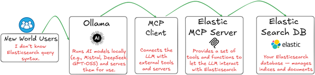

# Query Elasticsearch with Natural Language using LLM, MCP, and Ollama

This repository contains everything you need to set up a local environment that lets you **query and explore Elasticsearch using plain human language**. The stack includes **Ollama** (local LLM), an **MCP Client**, the **Elasticsearch MCP Server** (Docker), and an **Elasticsearch DB** with sample data. The setup is designed to run on **WSL2/Ubuntu** or any Linux host with Docker.

---

## Project Overview

In this project, you’ll be able to:

- Run a local **LLM** with **Ollama** (e.g., Qwen2.5)  
- Use an **MCP Client** to connect the LLM to tools  
- Start the **Elasticsearch MCP Server** via Docker  
- Launch **Elasticsearch DB** with **sample data** (cars)  
- Ask questions like *“show me my indices”* — **no raw Elasticsearch queries required**

---

## Key Components

- **Ollama** – Runs LLMs locally on your machine  
- **MCP Client** – Bridges the LLM and external tools  
- **Elasticsearch MCP Server** – Exposes safe, read-oriented tools to query Elasticsearch  
- **Elasticsearch** – Fast, scalable search & analytics engine (Dockerized)  
- **Docker / Docker Compose** – For repeatable local setup

> **Air-gapped friendly:** After pulling the LLM model with Ollama, you can run the whole setup **without internet**.

---

## Medium Blog

Full step-by-step walkthrough with screenshots and tips:  
**Query Elasticsearch with Natural Language using LLM, MCP, and Ollama**  
https://david-dudu-zbeda.medium.com/query-elasticsearch-with-natural-language-using-llm-mcp-and-ollama-1897738b7b43

---

## Repository Files

- `./elasticsearch-db/elasticsearchdb-docker-compose-with-data.yml`  
  Docker Compose for Elasticsearch + init job that loads **cars** sample data
- `./mcpclient/mcphost`  
  Prebuilt MCP client host binary (executable launcher)
- `./mcpclient/elastic-mcp-config.conf`  
  MCP client configuration that starts the **Elasticsearch MCP Server** Docker image and connects it to your Elasticsearch

---

## Connect on LinkedIn and Medium

- LinkedIn: https://www.linkedin.com/in/davidzbeda  
- Medium: [https://medium.com/@dudu.zbeda_13698](https://medium.com/@david-dudu-zbeda)

**David (Dudu) Zbeda**
